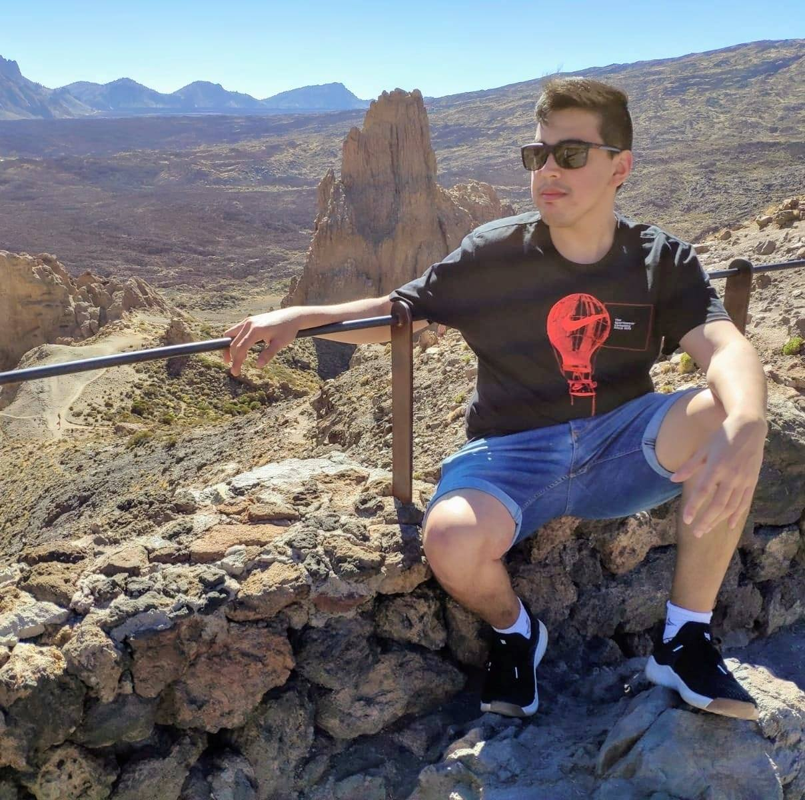

# Presentación

## Estudiante: Brian Ramirez

Mi nombre es Brian Ramirez y tengo 25 años. Soy estudiante tanto de la tecnicatura como de la licenciatura. Vivo en San Francisco Solano, Quilmes.
Trabajo hace 5 años en una empresa llamada Despegar. Primero como QA luego como Dev. 
Busco aprender y solidificar conocimientos en programacion y en nuevas tecnologias. Hoy en dia estoy muy interesado en la tecnologia Blockchain.
Amo la musica, los gatos, el asado, viajar y el lolsito.
